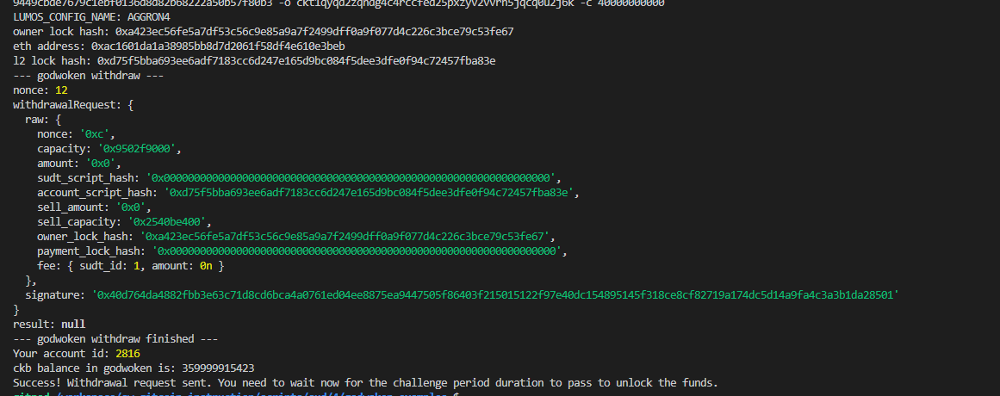

## 1. A screenshot of the console output immediately after running the withdraw command.

## 2. The Ethereum address that you've used for your Layer 2 account (in text format).
0xac1601da1a38985bb8d7d2061f58df4e610e3beb

## 3. The Nervos Layer 1 address that you passed to withdraw command (in text format).
ckt1qyqd2zqndg4c4rccfed25pxzyv2vvrh5jqcq0u2j6k