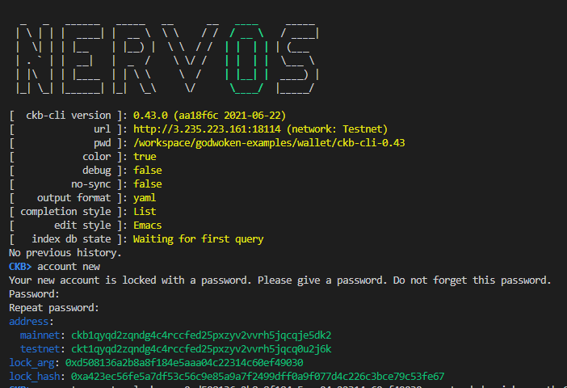
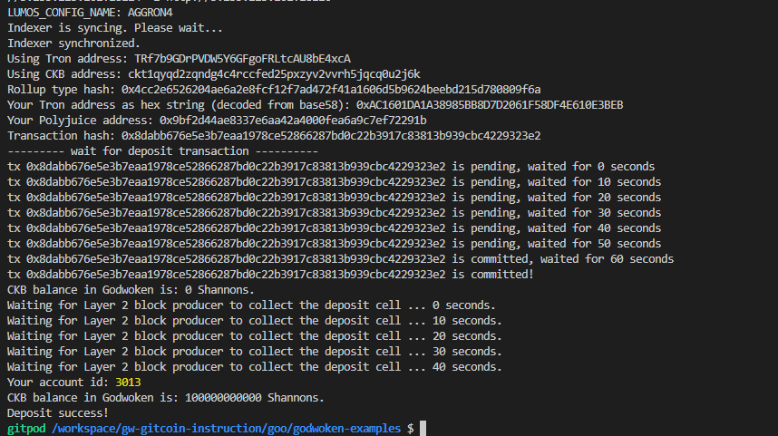
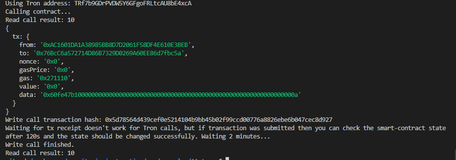

# 1. A screenshot of the accounts you created (account list) in ckb-cli



# 2. A link to the Layer 1 address you funded on the Testnet Explorer

https://explorer.nervos.org/aggron/address/ckt1qyqd2zqndg4c4rccfed25pxzyv2vvrh5jqcq0u2j6k

# 3. A screenshot of the console output immediately after you have successfully submitted a CKByte deposit to your Tron account on Layer 2




# 4. A screenshot of the console output immediately after you have successfully issued a smart contract calls on Layer 2




# 5. The transaction hash of the "Contract call" from the console output (in text format)

0x5d78564d439cef0e5214104b9bb45b02f99ccd00776a8826ebe6b047cec8d927

# 6. The contract address that you called (in text format)

0x76BcC6a572714D86B7329D0269A60EE86d7fbc5a

# 7. The ABI for contract you made a call on (in text format)

```json
[
    {
      "inputs": [
        {
          "internalType": "uint256",
          "name": "n",
          "type": "uint256"
        }
      ],
      "name": "setX",
      "outputs": [],
      "stateMutability": "payable",
      "type": "function"
    },
    {
      "inputs": [],
      "name": "pow",
      "outputs": [
        {
          "internalType": "uint256",
          "name": "",
          "type": "uint256"
        }
      ],
      "stateMutability": "view",
      "type": "function"
    }
]
```

# 8. Your Tron address (in text format)

TRf7b9GDrPVDW5Y6GFgoFRLtcAU8bE4xcA