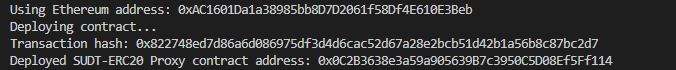
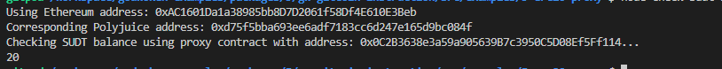

## Task 5 Deploy The ERC20 Proxy Contract For The Deposited SUDT

1.


2.The address of the ERC20 Proxy Contract you deployed .
```sh
0x0C2B3638e3a59a905639B7c3950C5D08Ef5Ff114
```

3.A screenshot of the console output immediately after checking your SUDT balance.


4.The Ethereum address that was checked 
```sh
0xAC1601Da1a38985bb8D7D2061f58Df4E610E3Beb
```